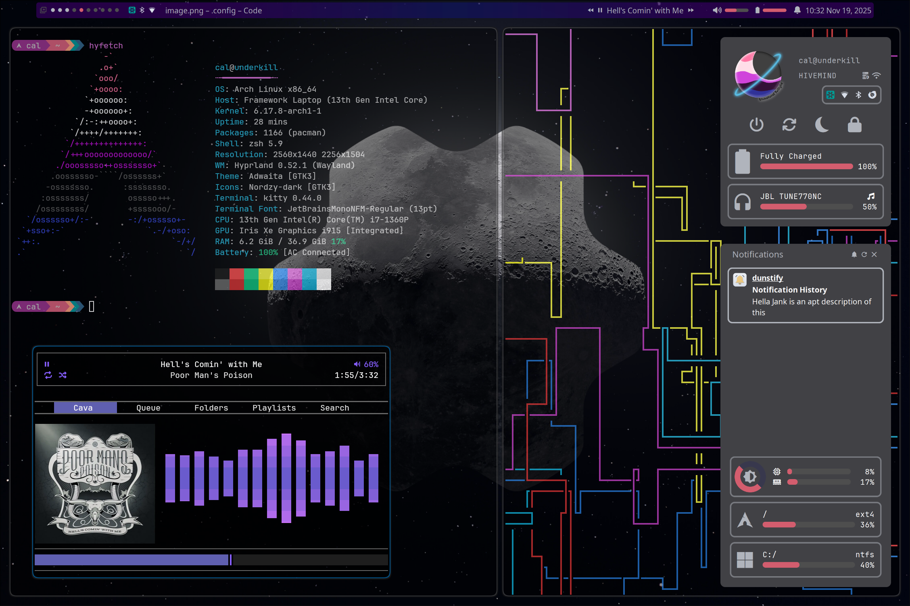

# Welcome to my dotfile
There is a 0% chance these work out of the box on your system, and I ain't going to fix that.

This is the first time I have used a full install of linux. Logically I decided to use Arch, these dot files are the result of many hours of reading wikis and throwing code at my system to see what would stick.

I have setup Hyprland with EWW for the bar. Everything else was me just picking at mostly random from the lists presented on the Arch and Hyprland wikis.

Couldn't have done this without all the example configs on the hypr wiki, they worked far better than what I tryed to cook up on my own.

## Shortlist of things I use not included in this repo
- zsh
- [Nordzy-cursors](https://github.com/guillaumeboehm/Nordzy-cursors)
- 

Credit to the peek joke of "Activate Linux" goes to [Activate Linux by Nycta](https://github.com/Nycta-b424b3c7/eww_activate-linux)