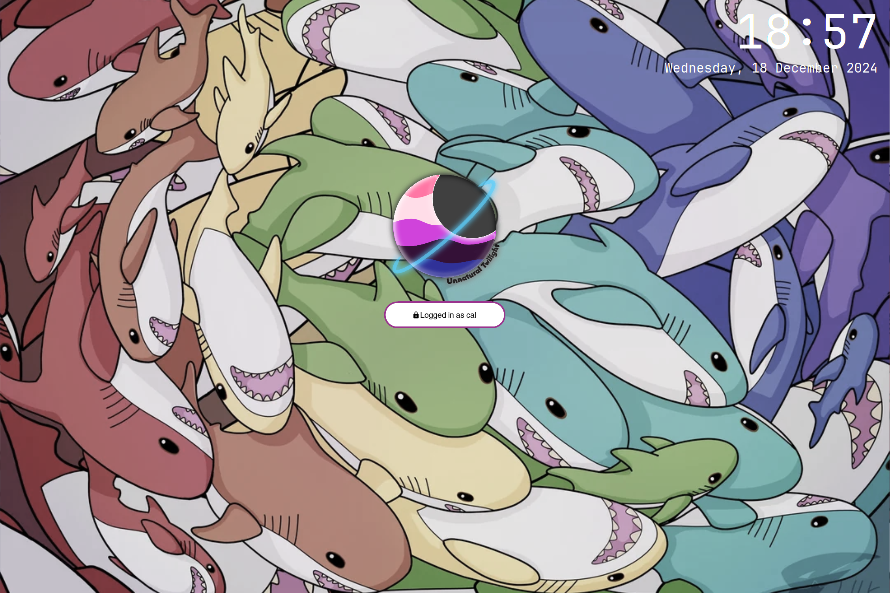

# Welcome to my dotfiles for underkill
There is a 0% chance these work out of the box on your system, and I ain't going to fix that.

This is the first time I have used a full install of linux. Logically I decided to use Arch, these dot files are the result of many hours of reading wikis and throwing code at my system to see what would stick.

I have setup Hyprland with EWW for the bar. Everything else was me just picking at mostly random from the lists presented on the Arch and Hyprland wikis.

Couldn't have done this without all the example configs on the Hypr wiki, Arch wiki, and many, many random repos on github. They worked far better than what I tried to cook up on my own.

## Shortlist of things I use not included in this repo
- [Nordzy-cursors](https://github.com/guillaumeboehm/Nordzy-cursors)
- Bash is configured to be much more frendly on the TTY (No Starship, etc)
- My scripts related to keeping thunderbird running in the background are a little too jank right now but will be moved in here when they get some polish

## Credits
Where i have copied others' configs I have tryed to include where it is from in a coment.

Desktop background [FrameMoon.jpg](FrameMoon.jpg) is from [3:2 desktop wallpapers on Framwork community fourms](https://community.frame.work/t/3-2-desktop-wallpapers/3533/49?u=unnaturaltwilight)

Lockscreen background [TwilightClouds.jpg](TwilightClouds.jpg) is from [Pixel Community Lens wallpapers](https://9to5google.com/2023/11/21/pixel-community-lens-wallpapers-2023/)

Credit to the peek joke of "Activate Linux" goes to [Activate Linux by Nycta](https://github.com/Nycta-b424b3c7/eww_activate-linux)